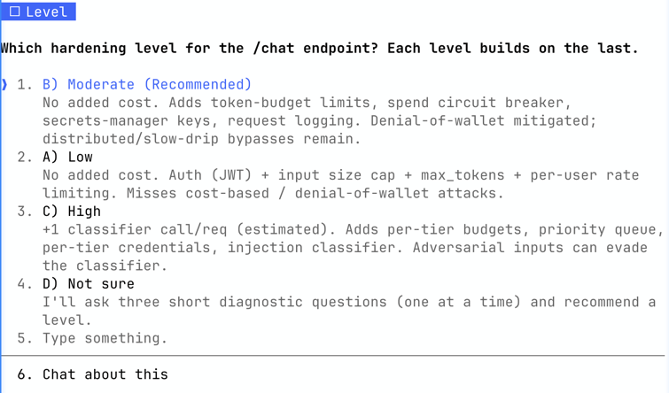

# llm-secure-patterns

OWASP Top 10 for LLM Applications 2025 — applied at code-time, not after the fact.

**v1.0.0** — Four rounds of cross-model adversarial review (Claude Sonnet 4.6, GPT-4o, Gemini 2.5 Pro, with Claude Opus 4.6 triage). Covers 7 of 10 OWASP LLM Top 10 2025 categories at code-time; the remaining 3 require organizational controls.

**Important!** Security guidance, not security guarantees. See [SCOPE.md](SCOPE.md) for full details.

## Why This Exists

Every existing security plugin in the Claude Code ecosystem either addresses traditional web app security or guards Claude Code's own session. None address the fastest-growing attack surface: **the applications developers are building on top of LLM APIs.**

This plugin fills that gap by making [OWASP Top 10 for LLM Applications 2025](https://owasp.org/www-project-top-10-for-large-language-model-applications/) (published November 2025) compliance a default behavior of Claude Code, not an afterthought.

## What It Does

**5 model-invoked skills** that trigger automatically when Claude detects relevant code patterns:

| Skill | Triggers When | OWASP Coverage |
|-------|---------------|----------------|
| Secure External Ingestion | Fetching URLs, scraping, RAG pipelines, external APIs | LLM01, LLM10 |
| LLM Endpoint Hardening | Building web routes that forward to LLM APIs | LLM01, LLM10 |
| Output Validation | Rendering, storing, or forwarding LLM responses | LLM05, LLM02, LLM09 |
| System Prompt Design | Writing or editing system prompts | LLM07, LLM01 |
| Agent Action Surface Control | Wiring up tool_use, MCP, multi-agent chains | LLM06, LLM01 |

Each skill presents **tiered mitigation options** (Low / Moderate / High) with risk vs. cost tradeoffs, so you understand what you're choosing and why.

## See It in Action

Say you're adding a `/chat` endpoint that forwards a user's message to the Claude API. Here is the code most developers write — and what this plugin does instead.

**Without the plugin** — this ships, it works, and it quietly exposes you:

```python
@app.post("/chat")
async def chat(request: ChatRequest):
    response = client.messages.create(
        model="claude-sonnet-4-6",
        messages=[{"role": "user", "content": request.message}],
    )
    return {"reply": response.content[0].text}
```

No authentication (anyone who finds the URL spends your API budget), no input cap, no `max_tokens` (a single "write the longest story you can" runs up the bill), no rate limiting. That is OWASP LLM01 and LLM10, live in production.

**With the plugin** — you start writing that same endpoint and the LLM Endpoint Hardening skill fires before any code is written. It leads with the intro (**A) Apply security now** / **B) Build first, secure later**), then a compact picker:



```
LLM Endpoint Hardening — OWASP LLM01/LLM10. Pick a level (each builds on the last):

A) Low — no added cost. Auth (JWT) + input size cap + max_tokens + per-user rate limiting.
   Misses cost-based / denial-of-wallet attacks.
B) Moderate (recommended) — no added cost. + token-budget limit + spend circuit breaker + secrets-manager keys + request logging.
   Denial-of-wallet mitigated; distributed / slow-drip bypasses remain.
C) High — +1 classifier call/req (estimated). + per-tier budgets + priority queue + per-tier credentials + injection classifier.
   Adversarial inputs can evade the classifier.

Reply A / B / C to apply · D if you're not sure · "details" (one tier) or "verbose" (all tiers) for the full breakdown.
```

Every tier names what it still does **not** catch, even in this compact form — that line never gets dropped. Reply `details B` to expand just that tier (evidence, known bypasses, layering requirements, and full cost/latency), or `verbose` to expand all three at once. Want the long form every time? Add `llm-secure-patterns: verbose` to your `CLAUDE.md`.

You pick a tier, and Claude writes the code with the audit trail baked in:

```python
# SECURITY: LLM01/LLM10 (Endpoint Hardening) — token-budget rate limiting, spend
#   circuit breaker, real-tokenizer input cap (fail-closed), and output-token cap
# Confidence: MODERATE — mitigates denial-of-wallet, but in-memory limiter/monitor
#   are single-process (use Redis in prod) and check/record is not atomic (TOCTOU).
# Level: Moderate
# Declined: High — no tiered budgets, request prioritization, or injection classifier (skipped per developer).
# Applied by: llm-secure-patterns v1.0.0 / LLM Endpoint Hardening
# Date applied: 2026-06-03
@app.post("/chat")
async def chat(request: ChatRequest, user: User = Depends(get_current_user)):
    if spend_monitor.is_kill_switch_triggered():
        raise HTTPException(503, "Service temporarily unavailable (spend cap).")
    # real-tokenizer input cap, fail-closed if counting is unavailable (elided)
    ...
    allowed, reason = budget_limiter.check_budget(user.id, estimated_tokens)
    if not allowed:
        raise HTTPException(429, "Rate limit exceeded. Try again later.")
    response = client.messages.create(
        model=CLAUDE_MODEL,
        max_tokens=MAX_OUTPUT_TOKENS,  # required — caps output denial-of-wallet
        messages=[{"role": "user", "content": request.message}],
    )
    ...
```

The `# SECURITY:` comments are the audit trail. Every control names its OWASP ID, confidence rating, tier, and known limitations — so a reviewer can see exactly what was applied, what was declined, and what still needs layering. Run `/llm-secure-patterns:report` at the end of the session to roll all of these up into a posture report.

## How It Works

### 1. You start building something LLM-shaped

You write the first line of a FastAPI route that calls Claude, a function that scrapes web content for a RAG pipeline, or a system prompt for an agent. Claude Code, with this plugin loaded, notices.

### 2. The relevant skill fires automatically

Based on the surface you're working on (endpoint, ingestion, output rendering, system prompt, agent action), the relevant skill triggers **before** Claude writes the code. You see an intro: "llm-secure-patterns has detected code that would benefit from…" with two options:

- **A) Apply security now** — walk through tier options before any code is written
- **B) Build first, secure later** — Claude builds the code and leaves a `TODO: SECURITY` marker for you to come back to

### 3. You pick a security level

Each skill offers tiered mitigations: **Low / Moderate / High**. The skill explains the tradeoffs for each — what it covers, what it doesn't catch, and latency/cost where they apply. If you're unsure, option D walks you through diagnostic questions and recommends a tier based on your answers.

### 4. Claude writes the code with annotations

The code ships with structured `# SECURITY:` comments showing OWASP ID, level chosen, pattern applied, confidence rating, and known bypasses. The annotations are the audit trail.

### 5. `/llm-secure-patterns:report` shows your coverage

Run the command at the end of any session. You get two files: `SECURITY_POSTURE.md` (CTO-facing, mapped to all 10 OWASP LLM categories with file paths and gaps) and `DEVELOPER_RECOMMENDATIONS.md` (follow-up scaffolds for the developer, scoped to skills that actually fired).

---

Every recommendation in any skill includes:
- **Confidence rating** (HIGH / MODERATE / LOW) with evidence
- **Known bypasses** — what the pattern doesn't catch
- **Layering requirements** — what else you need for defense-in-depth
- **False solution warnings** — patterns this skill explicitly rejects

## Install

Install from the Claude Code community marketplace:

```bash
/plugin marketplace add anthropics/claude-plugins-community
/plugin install llm-secure-patterns@claude-community
```

Or directly from this repo:

```bash
/plugin marketplace add wildblue-ai/llm-secure-patterns
/plugin install llm-secure-patterns@wildblue-ai
```

## Usage pattern

The five skills are designed to fire automatically when Claude Code detects a matching surface (web route forwarding to an LLM, external content ingestion, output rendering, system prompt authoring, multi-agent/MCP wiring). When a skill fires, it walks the developer through a tiered choice (Low / Moderate / High) and applies the chosen controls with `# SECURITY:` annotations in the generated code.

**Run `/llm-secure-patterns:report` at the end of any session that touched LLM code** — even if you saw the security intros fire during implementation. Model behavior varies, and a skill can occasionally miss its trigger (asking a clarifying implementation question before firing the security skill, for example). The report scans your codebase for `# SECURITY:` annotations and produces two files: `SECURITY_POSTURE.md` (posture against the OWASP LLM Top 10, for sharing with reviewers) and `DEVELOPER_RECOMMENDATIONS.md` (follow-up scaffolds and advisories for the developer, scoped to skills that actually fired). Together they make it easy to spot LLM surfaces where no security skill landed and to know what action remains. Treat running the report as a standing safety net, not an optional extra.

### How options are presented

When a skill fires it shows a **brief picker** by default — one line per tier (Low / Moderate / High) with the tier's added cost and the single most important thing it does not catch, then an action line:

- **Apply** — reply `A` / `B` / `C`.
- **Decide** — reply `D`; the skill asks a few diagnostic questions, then recommends a tier.
- **Go deeper** — reply `details B` (or any tier letter) to expand just that tier: full control list, evidence, known bypasses, layering requirements, and full cost/latency. Plain `details` expands the recommended tier; `verbose` expands all three at once.
- **Always verbose** — add a line `llm-secure-patterns: verbose` to your project or user `CLAUDE.md`. The skills read it from context and show full detail for all tiers instead of the brief picker. An explicit preference always beats the brief default.

The "what it does not catch" line is never dropped, even in the briefest form — informed choice is the point.

### Running unattended

Two different kinds of prompt interrupt a Claude Code session:

1. **Tool-approval prompts** — "Can I write this file? Can I run this command?" These are Claude Code's permission system. `--dangerously-skip-permissions` silences them. Appropriate for scratch directories and throwaway work; use with care in real projects.
2. **Skill choice prompts** — "Pick Low, Moderate, or High for this security tier." These are conversational, not permission prompts. `--dangerously-skip-permissions` does NOT silence them. The skills ask because the tradeoffs (latency, cost, coverage) depend on your context.

To pre-seed the skill choices and run fully unattended, embed the answers in your initial prompt:

```
Build [your thing]. For all llm-secure-patterns security skills:
apply security now (option A), choose Level C (High) for all tiers,
and skip remaining gaps (option C).
```

The three answers cover all skill UX branches: **intro** (apply now vs build first), **tier** (Low / Moderate / High), and **gap handling** (address / backlog / skip). With all three pre-seeded, skills apply the chosen posture and land `# SECURITY:` annotations without pausing.

**Tradeoff worth naming:** the tier prompts exist so you make informed choices. Skipping them with an all-High pre-seed gives you strong defaults, but you lose the moment where the skill shows you what each tier costs in latency and tokens. For a first pass on a new project, running interactive once (to see what is being applied) and unattended afterward is often the right pattern.

## OWASP LLM Top 10 Coverage

This plugin maps to the [OWASP Top 10 for LLM Applications 2025](https://owasp.org/www-project-top-10-for-large-language-model-applications/) (published November 2025). Skills are organized by developer activity, not by OWASP category — so multiple skills address the same risk from different angles (defense in depth).

### The 10 OWASP LLM Risks

| ID | Risk | Description | Plugin Coverage |
|----|------|-------------|-----------------|
| LLM01 | Prompt Injection | Malicious input manipulates model behavior — directly via user input or indirectly via external content | 4 skills (Ingestion, Endpoint, Prompt Design, Agent Surface) |
| LLM02 | Sensitive Info Disclosure | Model leaks PII, credentials, or system prompt contents in responses | 2 skills (Output Validation, Prompt Design) |
| LLM03 | Supply Chain | Compromised models, training data, or dependencies | Not addressable by code-time guidance |
| LLM04 | Data/Model Poisoning | Tampered training data or model weights | Not addressable by code-time guidance |
| LLM05 | Improper Output Handling | Model output used without validation — XSS, SQL injection, code execution | 1 skill (Output Validation) |
| LLM06 | Excessive Agency | Model has more permissions than necessary — too many tools, unnecessary write access | 1 skill (Agent Action Surface) |
| LLM07 | System Prompt Leakage | System prompt extracted via clever querying | 1 skill (Prompt Design) |
| LLM08 | Vector/Embedding Weaknesses | Attacks on vector databases and embedding pipelines | Not addressable by code-time guidance |
| LLM09 | Misinformation | Model generates false or misleading content | Partially (Output Validation) |
| LLM10 | Unbounded Consumption | Denial-of-wallet and resource exhaustion attacks | 2 skills (Ingestion, Endpoint Hardening) |

**Coverage: 7 of 10 categories addressed** (6 fully, 1 partially). The 3 not addressed (LLM03, LLM04, LLM08) require organizational controls — verified model sources, training data integrity, and vector database security — that cannot be addressed by development-time guidance. See [SCOPE.md](SCOPE.md) for details.

### Why LLM01 Appears in 4 Skills

Prompt injection is the #1 OWASP LLM risk because it can enter at every point in the pipeline. Each skill addresses it from a different angle:

| Entry point | Skill | What it does |
|-------------|-------|-------------|
| External content (scraped pages, APIs, RAG) | Secure External Ingestion | Sanitizes, normalizes encodings, wraps as untrusted |
| User input via API endpoint | LLM Endpoint Hardening | Auth, rate limiting, input size caps |
| System prompt structure | System Prompt Design | Delimiters, anti-extraction, credential separation |
| Cross-model/cross-agent data flow | Agent Action Surface Control | Trust boundaries, stage isolation, credential separation |

**Language agnostic:** Security guidance applies regardless of your programming language. Skills include inline examples in both Python and TypeScript. Full runnable templates are Python-only in v1.0.0 — TypeScript templates planned for v1.1.0 (PRs welcome).

**`/llm-secure-patterns:report`** — Generates two audit-ready reports from the `# SECURITY:` annotations in your codebase:

- **`SECURITY_POSTURE.md`** — CTO-facing strategic posture mapped to all 10 OWASP LLM categories, with file paths, confidence levels, and risk tradeoff documentation.
- **`DEVELOPER_RECOMMENDATIONS.md`** — Developer-facing follow-up scaffolds and advisories for decisions only the developer can make (e.g., "switch from the `len/4` heuristic to `client.messages.count_tokens()` before serving non-English traffic"). Only recommendations whose owning skill actually fired in your codebase are included.

Example output: [`SAMPLE_SECURITY_POSTURE_REPORT.md`](examples/SAMPLE_SECURITY_POSTURE_REPORT.md) · [`SAMPLE_DEVELOPER_RECOMMENDATIONS_REPORT.md`](examples/SAMPLE_DEVELOPER_RECOMMENDATIONS_REPORT.md)

A disposition prompt at the end lets you commit both, gitignore both, or mix — useful for public repos where the posture report is auditable but the developer to-do list is not public.

## What This Is NOT

- Not a runtime scanner or WAF
- Not a guarantee of security
- Not a replacement for professional security review
- Not general application security (see [SCOPE.md](SCOPE.md) and the Related plugins table below)
- **Not authoritative on LLM pricing** — cost and latency estimates shown for Level C tier options are approximations from the model's training-time knowledge. LLM provider pricing changes; verify against current pricing pages before using estimates for budgeting decisions.

See [SCOPE.md](SCOPE.md) for detailed coverage boundaries.

## Related plugins

This plugin is **complementary, not competing** with general-application-security tools. Install whichever combination matches your stack.

Anthropic ships `security-guidance` in the official marketplace as a code-time hook for traditional appsec patterns (command injection, XSS, eval, pickle, os.system). `llm-secure-patterns` is built to be installed alongside it — the two cover different frameworks (OWASP Top 10 vs. OWASP Top 10 for LLM Applications) at different lifecycle stages.

**Mental model:** `security-sweep` is ESLint for LLM apps (scan-and-report). `llm-secure-patterns` is a senior code reviewer pairing with you during development (ask-explain-apply).

| Stage | Need | Plugin |
| --- | --- | --- |
| **Design-time** | LLM-application architectural decisions — prompt injection mitigation, system prompt design, agent action surface, OWASP LLM Top 10 coverage at the moment code is being written | `llm-secure-patterns` (this plugin) |
| **Code-time** | General code patterns flagged at edit-time — XSS, `eval`, `pickle`, command injection, `os.system` | [`security-guidance`](https://claude.com/plugins/security-guidance) — Anthropic-shipped pre-tool hook |
| **Code-time** | Real-time SAST hooks during editing | [Semgrep](https://semgrep.com) (via MCP server) |
| **On-demand** | Whole-codebase regex/pattern scan covering OWASP Top 10 (2025), Mobile Top 10 (2024), and LLM Top 10 (2025) — secrets, injection, auth, config, dependencies, AI-specific patterns | [`security-sweep`](https://github.com/Onome-AJ/security-sweep-plugin) — community plugin, `/security-sweep` slash command |
| **Runtime** | SAST and secrets scanning in CI/CD | [Semgrep](https://semgrep.com), [Aikido Security](https://www.aikido.dev), [Gitleaks](https://github.com/gitleaks/gitleaks) |
| **Pre-deployment** | Human security audit | Engagement with a security firm, not automated tooling |

`llm-secure-patterns` maps to the [OWASP Top 10 for LLM Applications 2025](https://owasp.org/www-project-top-10-for-large-language-model-applications/) — a different framework from the traditional OWASP Top 10. Coverage of LLM-specific categories (LLM01–LLM10) is largely orthogonal to general web-app or runtime-security tooling, with the exception of `security-sweep`, which intentionally spans both frameworks at the regex/pattern-detection layer.

## Author

**Cheryl Aday** — Founder, [WildBlue.AI](https://wildblue.ai)
AI Risk & Readiness Consultancy | Pre-deployment audits for SMBs

For comprehensive AI security assessments beyond what automated tooling provides:
support@wildblue.ai

## Acknowledgments

Co-written with Claude Code, for Claude Code. Architectural decisions, security tradeoff judgment, adversarial review interpretation, and product direction by Cheryl Aday; code drafting, documentation, and refactoring assistance by Claude.

Influences and references:

- [OWASP GenAI Security Project](https://genai.owasp.org)
- [Anthropic's prompt injection research](https://anthropic.com/research)
- Lakera's Gandalf benchmark and indirect prompt injection research

## License

MIT — see [LICENSE](LICENSE)
